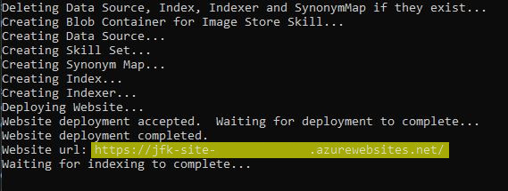

# The JFK Files
Explore the JFK Assassination files using the AI Enrichment features of Azure Cognitive Search. You can watch the demo in action in a short [online video](https://channel9.msdn.com/Shows/AI-Show/Using-Cognitive-Search-to-Understand-the-JFK-Documents) or explore the JFK files yourself with our [online demo](https://aka.ms/jfkfiles-demo).

## Cognitive Search - An AI-first approach to content understanding
This project demonstrates how you can use both the built-in and custom AI in Cognitive Search. Cognitive Search ingests your data from almost any datasource and enriches it using a set of cognitive skills that extracts knowledge and then lets you explore the data using Search.


## JFK Files Architecture
The JFK files example leverages the built-in Cognitive Skills inside of Cognitive Search and combines it with custom skills using extensibility.  The architecture below showcases how the new Cognitive Search capabilities of Azure enable you to easily create structure from almost any datasource.


Note: This diagram of visuals are inspired by the [CIA's JFK document management system in 1997](https://www.archives.gov/files/research/jfk/releases/docid-32404466.pdf) included in the JFK files.

This project includes the following capabilities for you to build your own version of the JFK files.
1. We have provided a subset of the [JFK PDF documents](https://www.archives.gov/research/jfk/2017-release) and images that have been uploaded to the cloud into Azure Blob Storage.
2. An [Azure Search](https://azure.microsoft.com/en-us/services/search/) service is used to index the content and power the UX experience. We use the new Cognitive Search capabilities to apply pre-built cognitive skills to the content, and we also use the extensibility mechanism to add custom skills using [Azure Functions](https://azure.microsoft.com/en-us/services/functions/).
    1. Uses the [Cognitive Services Vision API](https://azure.microsoft.com/en-us/services/cognitive-services/computer-vision/) to extract text information from the image via OCR, and image captioning,
    2. Applies Named Entity Recognitition to extract named entities from the documents,
    3. Annotates text using a custom [CIA Cryptonyms](https://www.maryferrell.org/php/cryptdb.php) skill,
    4. Generates [HOCR content](https://en.wikipedia.org/wiki/HOCR) based on results.
3. A standalone website to search the index and explore the documents

## Limitations and Considerations
1. This is a demo to showcase a Cognitive Search use case.  It is not intended to be a framework or scalable architecture for all scenarios, though it can give you an idea of what your scenario might end up looking like.
2. The OCR technology is not perfect; results will vary greatly by scan and image quality.
3. Most file formats and datasources are supported, however some scanned and native PDF formats may not be parsed correctly.
4. **IMPORTANT: The JFK Files sample creates a public website and a publicly readable storage container for any extracted images.  As-is, it is not suitable for using with non-public data.**

## Setting up your own JFK files library

These instructions will help you have your own version of the JFK files demo running in Azure in about 20 minutes, with most of that time being provisioning/deployment time.

### Prerequisites
1. An Azure Subscription you can access and deploy resources to.
    1. Note that this demo requires writing to an Azure Storage Account, which you will be billed monthly for the storage written to, and by default provisions a Basic Azure Search service which is billed hourly.  For an estimation of cost, reference the [Azure Pricing Calculator](https://azure.microsoft.com/en-us/pricing/calculator/).  In addition, you will be charged for the Cognitive Search part of the demo, which is transaction based.  These charges used with the provided files should be about $15 USD.  [See here for details](https://docs.microsoft.com/en-us/azure/search/cognitive-search-attach-cognitive-services) on what costs may look like if you choose to use Cognitive Search with your own dataset.
2. [Visual Studio 2019](https://www.visualstudio.com/downloads/) with [Azure Developer Tools](https://azure.microsoft.com/en-us/tools/) enabled.  The free community edition will work fine.
3. [Node.js](https://nodejs.org/) must be installed on your computer.
4. Basic familiarity with using the [Azure Portal](https://portal.azure.com) and cloning and compiling code from github.

### Deploy Required Resources

1. Click the below button to upload the provided ARM template to the Azure portal, which is written to automatically deploy and configure the following resources:
    1. An Azure Search service, default set to [Basic](https://azure.microsoft.com/en-us/pricing/details/search/) tier.
    2. An Azure Blob Storage Account, default set to [Standard LRS](https://azure.microsoft.com/en-us/pricing/details/storage/) tier.
    3. An Azure App Service plan, default set to [Free F1](https://azure.microsoft.com/en-us/pricing/details/app-service/plans/) tier.
    4. An Azure Web App Service, using the plan from # 3.
    5. An Azure Function instance, using the storage account from # 2 and the plan from # 3.  The Azure Function will be prepublished with the code provided in this repository as part of the template deployment.
    6. A Cognitive Services account, of type [CognitiveServices](https://azure.microsoft.com/en-us/pricing/details/cognitive-services/), that will be used for billing your Cognitive Search skills usage.

    </br>
    <a href="https://portal.azure.com/#create/Microsoft.Template/uri/https%3A%2F%2Fraw.githubusercontent.com%2FMicrosoft%2FAzureSearch_JFK_Files%2Fmaster%2Fazuredeploy.json" target="_blank">
        
    </a>

2. Be sure to select the appropriate subscription to deploy to, and create a new resource group for these resources. Only use alphanumeric lowercase characters for the Resource Prefix field.
3. Review the rest of the parameters as well as the terms and conditions, select the checkbox for "I agree to the terms and conditions stated above", and press "Purchase".
4. Monitor the status of the deployment by following the link that appears in the Azure portal notifications.  It takes about 5 minutes for the resources to be fully provisioned and deployed.

    

### Initialize the code

5. While you are waiting for the resources to finish provisioning, either git clone or download this repo, and open the provided solution file *JfkWebApiSkills/JfkWebApiSkills.sln* using Visual Studio 2019.
6. In the root of the *JfkInitializer* project, open the *App.config* file.  You will be copying and pasting some secrets into this file momentarily.
7. Make sure that the *JfkInitializer* project is set as your default project if it isn't already.

### Run the initializer

8. Once your resources are finished deploying (you should get a notification in the Azure portal), navigate to the *Outputs* section of the deployment.

    

    

9. Copy and paste each of the provided outputs from this interface into their corresponding value location in the *App.config* file from before.  Note that one value will be missing from the outputs, the *SearchServiceQueryKey*.
10. In order to obtain the *SearchServiceQueryKey*, navigate back to the *Overview* section of the deployment and find your newly created Azure Search service in the list (Its type will be *Microsoft.Search/searchServices*).  Select it.

    

11. Select the *Keys* section, followed by *Manage query keys*.  Copy and paste the key value shown into the *SearchServiceQueryKey* value of your *App.config* file.

    

12. Now you should have filled in all of the required configurations in the *App.config* file.  Save your changes, and press the start button at the top of Visual Studio in order to run the initializer.

    

13. After a few seconds, the message "Website keys have been set.  Please build the website and then return here and press any key to continue." will be output to the console app.  At this point, open a separate cmd window and cd into the directory of where you cloned or downloaded the repo.  Then run the following commands:

    ```shell
    cd frontend
    npm install
    npm run build:prod
    ```

14. After the commands finish running, return to the console app and press any key to continue.

15. Once the website is deployed, a URL will appear in the console.  Copy and paste this URL into a browser to start interacting with what you have created!

    

### Results

This project will create several things for you.  It will deploy an Azure Function using the code provided in the *JfkWebApiSkills* project, as well as create an Azure Search data source, skillset, synonym map, index, and indexer.  It will also create a blob storage container that the images will be reuploaded to, as well as deploys the JFK Files frontend to an Azure web app that you can immediately interact with.  Feel free to play with the code to see how all of these things are accomplished so that you can start using Cognitive Search for your data enrichment scenario today.

### Debugging

If you encounter issues running this demo, there are several ways you can debug what may be wrong.

1. In *./JfkWebApiSkills/JfkInitializer/Program.cs*, you can set the "DebugMode" variable to true in order to see the output for REST calls that are made to create resources and why they may be failing.  The Initializer will prompt you to do this if it suspects there is an issue creating anything it needs to create.
2. You can add the "enriched" field to your index to see detailed output of all skills that are run.  [Details on how to do this can be found here.](https://docs.microsoft.com/azure/search/cognitive-search-concept-troubleshooting#tip-4-looking-at-enriched-documents-under-the-hood)  You will be making this change in *./JfkWebApiSkills/JfkInitializer/SearchResources.cs*.
3. If all else fails, feel free to [post your problem as a Github issue](https://github.com/Microsoft/AzureSearch_JFK_Files/issues/new), which we monitor and respond to when necessary.

## Next Steps

The [Azure Architecture Center](https://aka.ms/architecture) has more content on [this solution](https://docs.microsoft.com/azure/architecture/solution-ideas/articles/cognitive-search-with-skillsets) and others in this space.
